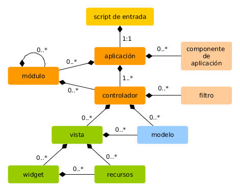

Información general
===================

Las aplicaciones realizadas con Yii están organizadas de acuerdo al patrón de diseño [modelo-vista-controlador (MVC)](http://es.wikipedia.org/wiki/Modelo%E2%80%93vista%E2%80%93controlador) 
[Modelo](structure-models.md) representa a los datos, lógica y reglas de negocio; [Vista](structure-views.md) 
es la salida o representación del modelo; y [Controlador](structure-controllers.md) atrapa la entrada y la convierte 
en instrucciones para los [modelos](structure-models.md) y [vistas](structure-views.md). 

Además de MVC, las aplicaciones Yii también tienen las siguientes entidades:

* [scripts de entrada](structure-entry-scripts.md): Existen scripts PHP directamente accesibles a los usuarios finales.
  Son los responsables de comenzar el ciclo de manejo de una solicitud.
* [aplicaciones](structure-applications.md): Son objetos accesibles globalmente que gestionan y coordinan los componentes 
  de la aplicacion con el fin de atender las diferentes solicitudes. 
* [componentes de la aplicación](structure-application-components.md): Son los objetos registrados con la aplicación, y
  proporcionan varios servicios para cumplir las solicitudes.
* [módulos](structure-modules.md): Son paquetes auto-contenidos los cuales por si solos poseen estructura MVC.
  Una aplicación puede estar organizada en términos de múltiples módulos.
* [filtros](structure-filters.md): Representan el código que debe ser invocado antes y despues de la ejecución de cada
  solicitud por los controladores.
* [widgets](structure-widgets.md): Son objetos que pueden ser embebidos en las [Vistas](structure-views.md). Pueden
  contener lógica del controlador y ser reutilizados en múltiples vistas.

El siguiente esquema muestra la estructura estática de una aplicación:

