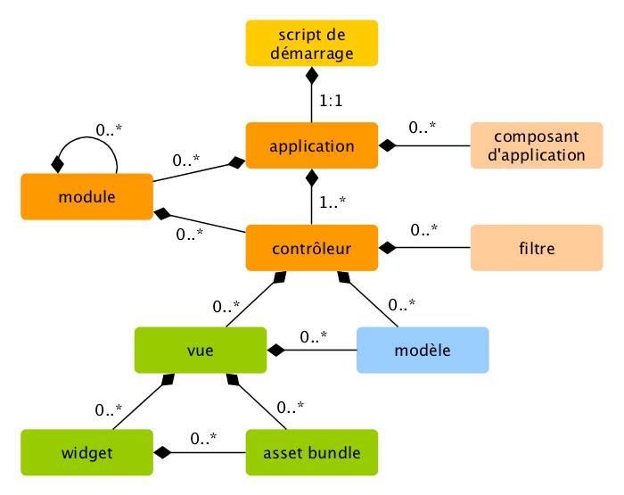

Fonctionnement des applications
===============================

Après avoir installé Yii, vous obtenez une application Yii fonctionnelle accessible via l'URL `http://hostname/basic/web/index.php` ou `http://hostname/index.php`, en fonction
de votre configuration. Cette section vous initiera aux fonctionalités intégrées à l'application,
à la manière dont le code est organisé, et à la gestion des requêtes par l'application.

> Info: Par simplicité, au long de ce tutoriel de démarrage, nous supposerons que `basic/web` est la racine de votre 
  serveur Web, et que vous avez configuré l'URL pour accéder à votre application comme suit ou similaire : 
  `http://hostname/index.php`.
  Pour vos besoins, merci d'ajuster les URLs dans notre description comme il convient.


Fonctionalité <a name="Functionality"></a>
-------------

L'application basique installée contient quatre pages :

* La page d'accueil, affichée quand vous accédez à l'URL `http://hostname/index.php`,
* la page "About" (A Propos),
* la page "Contact", qui présente un formulaire de contact permettant aux utilisateurs finaux de vous contacter par email,
* et la page "Login" (Connexion), qui presente un formulaire de connexion qui peut être utilisé pour authentifier des utilisateurs finaux. Essayez de vous connecter
  avec "admin/admin", et vous verrez l'élément "Login" du menu principal être remplacé par "Logout" (Déconnexion).

Ces pages ont en commun une entête et un pied de page. L'entête contient une barre de menu principal qui permet la navigation
entre les différentes pages.

Vous devriez également voir une barre d'outils en bas de votre fenêtre de navigation.
C'est un [outil de déboggage](tool-debugger.md) utile fourni par Yii pour enregistrer et afficher de nombreuses informations de déboggage, telles que des messages de logs, statuts de réponses, les requêtes lancées vers la base de données, et ainsi de suite.


Structure de l'Application <a name="application-structure"></a>
---------------------

Les répertoires et fichiers les plus importants de votre application sont (en supposant que le répertoire racine de l'application est `basic`) :

```
basic/                  chemin de base de l'application
    composer.json       utilisé par Composer, décrit les information de paquets
    config/             contient les configurations de l'application et autres
        console.php     configuration de l'application console
        web.php         configuration de l'application Web
    commands/           contient les classes de commandes console
    controllers/        contient les classes de controlleurs
    models/             contient les classes de modèles
    runtime/            contient les fichiers générés par Yii au cours de l'exécution, tels que les fichiers de logs ou de cache and cache
    vendor/             contient les paquets Composer installés, y compris le framework Yii
    views/              contient les fichiers de vues
    web/                racine Web de l'application, contient les fichiers accessibles via le Web
        assets/         contient les fichiers assets (javascript et css) publiés par Yii
        index.php       le script d'entrée (ou bootstrap) pour l'application
    yii                 le script d'exécution de Yii en commande console
```

Dans l'ensemble, les fichiers de l'application peuvent être séparés en deux types : ceux situés dans `basic/web` et ceux situés dans d'autres répertoires. Les premiers peuvent être atteints directement en HTTP (c'est à dire dans un navigateur), tandis que les seconds doivent pas l'être.

Yii implémente le patron de conception [modèle-vue-contrôleur (MVC)](http://fr.wikipedia.org/wiki/Mod%C3%A8le-vue-contr%C3%B4leur),
ce qui se reflète dans l'organisation des répertoires ci-dessus. Le répertoire `models` contient toutes les [classes modèles](structure-models.md),
le répertoire `views` contient tous les  [scripts de vue](structure-views.md), et le répertoire `controllers` contient toutes les [classes contrôleurs](structure-controllers.md).

The following diagram shows the static structure of an application.



Each application has an entry script `web/index.php` which is the only Web accessible PHP script in the application.
The entry script takes an incoming request and creates an [application](structure-applications.md) instance to handle it.
The [application](structure-applications.md) resolves the request with the help of its [components](concept-components.md),
and dispatches the request to the MVC elements. [Widgets](structure-widgets.md) are used in the [views](structure-views.md)
to help build complex and dynamic user interface elements.


Request Lifecycle <a name="request-lifecycle"></a>
-----------------

The following diagram shows how an application handles a request.


1. A user makes a request to the [entry script](structure-entry-scripts.md) `web/index.php`.
2. The entry script loads the application [configuration](concept-configurations.md) and creates
   an [application](structure-applications.md) instance to handle the request.
3. The application resolves the requested [route](runtime-routing.md) with the help of
   the [request](runtime-requests.md) application component.
4. The application creates a [controller](structure-controllers.md) instance to handle the request.
5. The controller creates an [action](structure-controllers.md) instance and performs the filters for the action.
6. If any filter fails, the action is cancelled.
7. If all filters pass, the action is executed.
8. The action loads a data model, possibly from a database.
9. The action renders a view, providing it with the data model.
10. The rendered result is returned to the [response](runtime-responses.md) application component.
11. The response component sends the rendered result to the user's browser.
