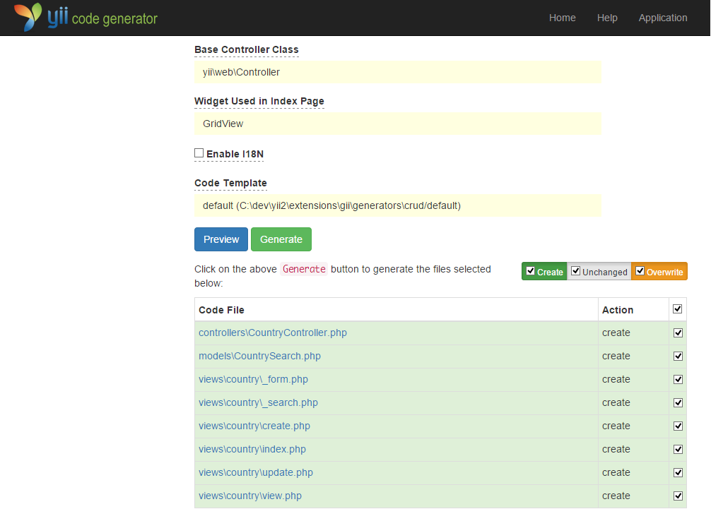
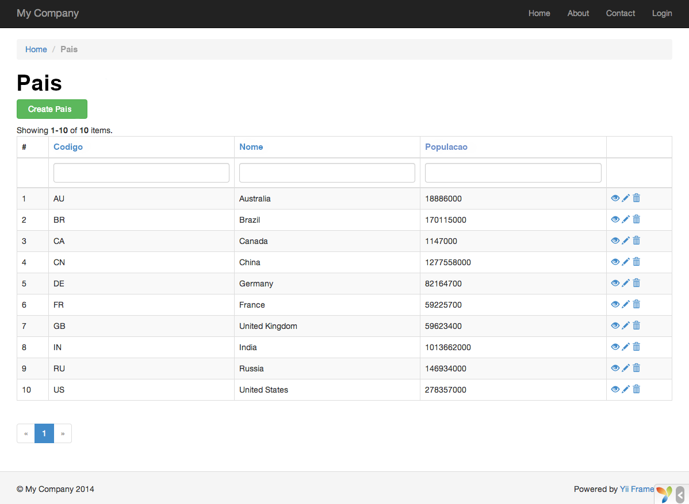
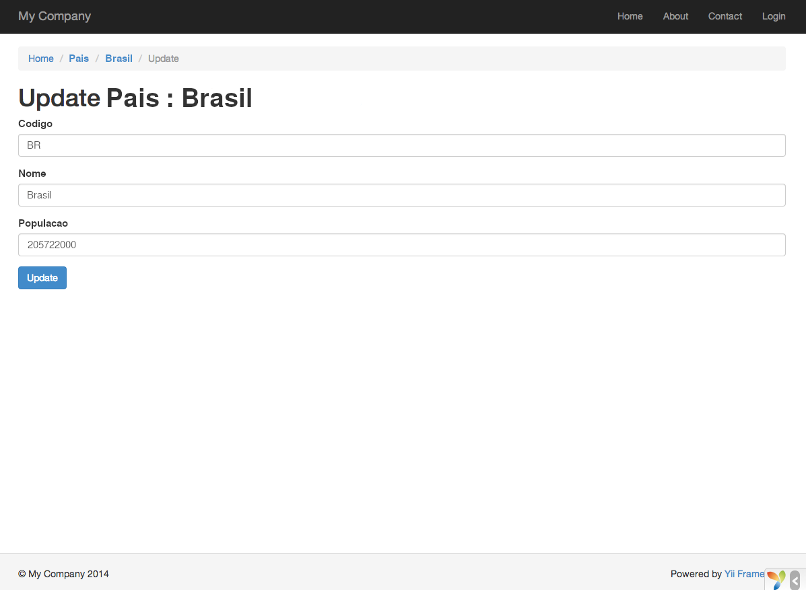

Gerando Código com Gii
========================

<<<<<<< HEAD
<<<<<<< HEAD
Essa seção irá descrever como usar o [Gii](tool-gii.md) para automaticamente gerar código que implementa algumas funcionalidades comuns de sites. Usar o Gii para gerar código é simples, trata-se apenas de uma questão de entrar com as informações corretas de acordo com as instruções mostradas nas páginas do Gii.
=======
Essa seção irá descrever como usar o [Gii](https://github.com/yiisoft/yii2-gii/blob/master/docs/guide-pt-BR/README.md) para automaticamente gerar código que implementa algumas funcionalidades comuns de sites. Usar o Gii para gerar código é simples, trata-se apenas de uma questão de entrar com as informações corretas de acordo com as instruções mostradas nas páginas do Gii.
>>>>>>> yiichina/master
=======
Essa seção irá descrever como usar o [Gii](https://github.com/yiisoft/yii2-gii/blob/master/docs/guide-pt-BR/README.md) para  gerar automaticamente código que implementa algumas funcionalidades comuns de sites. Usar o Gii para gerar código é simples, trata-se apenas de uma questão de entrar com as informações corretas de acordo com as instruções mostradas nas páginas do Gii.
>>>>>>> master

Através desse tutorial, você irá aprender a:

* Habilitar o Gii em sua aplicação
* Usar o Gii para gerar uma classe Active Record
* Usar o Gii para gerar código que implementa as operações CRUD para uma tabela do BD
* Customizar o código gerado pelo Gii


Começando a usar o Gii <span id="starting-gii"></span>
------------

<<<<<<< HEAD
<<<<<<< HEAD
O [Gii](tool-gii.md) é fornecido com o Yii como um [módulo](structure-modules.md). Você pode habilitar o Gii ao configurá-lo na propriedade [[yii\base\Application::modules|modules]] da aplicação. Dependendo de como você criou sua aplicação, você pode já encontrar o seguinte código no arquivo de configuração `config/web.php`:
=======
O [Gii](https://github.com/yiisoft/yii2-gii/blob/master/docs/guide-pt-BR/README.md) é fornecido com o Yii como um [módulo](structure-modules.md). Você pode habilitar o Gii ao configurá-lo na propriedade [[yii\base\Application::modules|modules]] da aplicação. Dependendo de como você criou sua aplicação, você pode já encontrar o seguinte código no arquivo de configuração `config/web.php`:
>>>>>>> yiichina/master
=======
O [Gii](https://github.com/yiisoft/yii2-gii/blob/master/docs/guide-pt-BR/README.md) é fornecido com o Yii como um [módulo](structure-modules.md). Você pode habilitar o Gii ao configurá-lo na propriedade [[yii\base\Application::modules|modules]] da aplicação. Dependendo de como você criou sua aplicação, você pode já encontrar o seguinte código no arquivo de configuração `config/web.php`:
>>>>>>> master

```php
$config = [ ... ];

if (YII_ENV_DEV) {
    $config['bootstrap'][] = 'gii';
    $config['modules']['gii'] = [
        'class' => 'yii\gii\Module',
    ];
}
```

A configuração acima declara que quando se está em [ambiente de desenvolvimento](concept-configurations.md#environment-constants), a aplicação deve incluir um módulo chamado `gii`, da classe [[yii\gii\Module]].

Se você checar o [script inicial](structure-entry-scripts.md) `web/index.php` da sua aplicação, você encontrará a seguinte linha, que essencialmente faz com que o `YII_ENV_DEV` seja verdadeiro.

```php
defined('YII_ENV') or define('YII_ENV', 'dev');
```

Graças a essa linha, sua aplicação está em modo de desenvolvimento e estará com o Gii habilitado, pela configuração acima. Agora você pode acessar o Gii pela URL:

```
http://hostname/index.php?r=gii
```

> Observação: Se você está acessando o Gii por um endereço IP que não seja o localhost, o acesso será negado por padrão.
> Para mudar isso, adicione a lista de endereços IP permitidos à configuração:
>
```php
'gii' => [
    'class' => 'yii\gii\Module',
    'allowedIPs' => ['127.0.0.1', '::1', '192.168.0.*', '192.168.178.20'] // ajuste de acordo com suas necessidades
],
```


Gerando uma classe Active Record <span id="generating-ar"></span>
---------------------------------

Para usar o Gii para gerar uma classe Active Record, selecione o "Model Generator" clicando no link na página inicial do Gii. Preencha o formulário como indicado abaixo:

* Nome da tabela: `country`
* Classe do modelo: `Country`


Em seguida, clique no botão "Preview". Você verá o `models/Country.php` listado como arquivo a ser criado. Você pode clicar no nome do arquivo para pré-visualizar seu conteúdo.

Ao usar o Gii, se você já havia criado o mesmo arquivo e pretende sobrescrevê-lo, clique no botão `diff` próximo ao nome do arquivo para ver as diferenças entre o código a ser gerado e a versão já existente.


Quando estiver sobrescrevendo um arquivo, marque a caixa próxima a "overwrite" (sobrescrever) e clique no botão "Generate". Se estiver criando um arquivo novo, apenas clique em "Generate".

Em seguida, você verá uma página de confirmação indicando que o código foi gerado com sucesso. Se você já tinha um arquivo, também verá uma mensagem indicando que ele foi sobrescrito com o novo código.


Gerando código CRUD <span id="generating-crud"></span>
--------------------

CRUD corresponde a Create, Read, Update, and Delete (criar, ler, atualizar e apagar), representando as quatro tarefas comuns feitas com os dados na maioria dos sites. Para criar funcionalidades CRUD usando o Gii, selecione "CRUD Generator" clicando no link na página inicial do Gii. Seguindo o exemplo "country", preencha o formulário com as seguintes informações:

* Classe do Modelo: `app\models\Country`
* Classe da Busca: `app\models\CountrySearch`
* Classe do Controller: `app\controllers\CountryController`


Em seguida, clique no botão "Preview". Você verá uma lista de arquivos a serem gerados, como mostrado abaixo.



Se você criou anteriormente os arquivos `controllers/CountryController.php` e
`views/country/index.php` (na seção de banco de dados deste guia), marque a caixa "overwrite" para substitui-los. (As versões anteriores não tinham suporte completo às operações CRUD.)


Checando os resultados <span id="trying-it-out"></span>
-------------

Para ver como ficou, use seu navegador para acessar a seguinte URL:

```
http://hostname/index.php?r=country/index
```

Você verá uma tabela mostrando os países do seu banco de dados. Você pode ordená-los ou filtrá-los inserindo condições nos cabeçalhos das colunas.

Para cada país exibido na tabela, você pode visualizar detalhes, editar ou excluir.
Você também pode clicar no botão “Create Country” no topo da tabela para ter acesso a um formulário de criação de um novo país.





Essa é uma lista de arquivos gerados pelo Gii, caso você queira investigar como essas funcionalidades são implementadas ou adaptá-las:

* Controller: `controllers/CountryController.php`
* Modelo: `models/Country.php` e `models/CountrySearch.php`
* Views: `views/country/*.php`

<<<<<<< HEAD
<<<<<<< HEAD
> Informação: o Gii é projetado para ser uma ferramenta altamente adaptável e extensível. Usando-o sabiamente, você irá acelerar o desenvolvimento da sua aplicação. Para mais detalhes, por favor siga para a seção [Gii](tool-gii.md).
=======
> Informação: o Gii é projetado para ser uma ferramenta altamente adaptável e extensível. Usando-o sabiamente, você irá acelerar o desenvolvimento da sua aplicação. Para mais detalhes, por favor siga para a seção [Gii](https://github.com/yiisoft/yii2-gii/blob/master/docs/guide-pt-BR/README.md).
>>>>>>> yiichina/master
=======
> Informação: o Gii é projetado para ser uma ferramenta altamente adaptável e extensível. Usando-o sabiamente, você irá acelerar o desenvolvimento da sua aplicação. Para mais detalhes, por favor siga para a seção [Gii](https://github.com/yiisoft/yii2-gii/blob/master/docs/guide-pt-BR/README.md).
>>>>>>> master


Resumo <span id="summary"></span>
-------

Nessa seção, você aprendeu a usar o Gii para gerar código que implementa funcionalidades CRUD para o conteúdo guardado em uma tabela do banco de dados.
