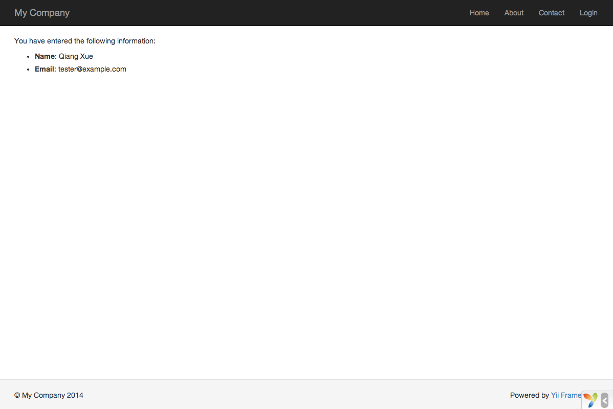

Работа с формами
==================

В данном разделе мы обсудим как вести работу с формами, чтобы получать данные от пользователя.
На странице будет располагаться форма с полями для имени и Email.
После получения этих данных от пользователя, они будут показаны на странице для подтверждения.

Чтобы достичь это цели, помимо создания [действия](structure-controllers.md) и двух [представлений](structure-views.md),
также необходимо создать [модель](structure-models.md).

В данном руководстве вы изучите

* Как создавать [модель](structure-models.md), чтобы представлять данные, введенные пользователем;
* Как объявлять правила, чтобы проверять введенные данные;
* Как создавать HTML форму в [представлении](structure-views.md).


Создание Модели <a name="creating-model"></a>
----------------

Для представления данных, введенных пользователем, создайте класс модели `EntryForm` как показано ниже и
сохраните класс в файле `models/EntryForm.php`. Пожалуйста, ознакомьтесь с разделом [Автозагрузка классов](concept-autoloading.md)
для большей информации о соглашении именования файлов классов.

```php
<?php

namespace app\models;

use yii\base\Model;

class EntryForm extends Model
{
    public $name;
    public $email;

    public function rules()
    {
        return [
            [['name', 'email'], 'required'],
            ['email', 'email'],
        ];
    }
}
```

Класс расширяет базовый класс [[yii\base\Model]], который является частью фреймворка и обычно используется
для представления форм данных.

Класс содержит 2 публичных свойства `name` и `email`, которые используются для хранения
данных, введенных пользователем. Он также содержит метод `rules()`, который возвращает набор правил,
используемых для проверки данных. Правила проверки, объявленные выше, устанавливают что

* оба `name` и `email` обязательны для заполнения;
* свойство `email` должно быть Email адресом в допустимом формате.

Если объект `EntryForm` заполнен данными, введенными пользователем, вы можете вызвать метод
[[yii\base\Model::validate()|validate()]], чтобы запустить проверку данных. В случае неудачной
проверки свойство [[yii\base\Model::hasErrors|hasErrors]] станет равным `true`, и с помощью [[yii\base\Model::getErrors|errors]]
вы можете узнать какие ошибки возникли в процессе проверки.


Создание Действия <a name="creating-action"></a>
------------------

Далее, создайте действие `entry` в контроллере `site`, как описывалось ранее.

```php
<?php

namespace app\controllers;

use Yii;
use yii\web\Controller;
use app\models\EntryForm;

class SiteController extends Controller
{
    // ...существующий код...

    public function actionEntry()
    {
        $model = new EntryForm;

        if ($model->load(Yii::$app->request->post()) && $model->validate()) {
            // допустимые данные в $model

            // сделать что-то значимое с $model ...

            return $this->render('entry-confirm', ['model' => $model]);
        } else {
            // отобразить начальную страницу, либо возникли ошибки при проверке данных
            return $this->render('entry', ['model' => $model]);
        }
    }
}
```

Действие создает объект `EntryForm`. Затем оно пытается заполнить модель данными из массива `$_POST`, доступ
к которому обеспечивает Yii при помощи [[yii\web\Request::post()]]. Если модель успешно заполнена, то есть пользователь отправил данные из HTML формы,
то будет вызван метод [[yii\base\Model::validate()|validate()]], чтобы удостовериться в корректности введенных данных.

Если все в порядке, действие отобразит представление `entry-confirm` для подтверждения пользователем верности введенных данных.
Иначе, будет отображено представление `entry`, которое содержит HTML форму вместе с ошибками проверки данных, если таковые есть.

> Информация: Выражение `Yii::$app` представляет экземпляр [приложения](structure-applications.md), который реализует паттерн "Одиночка" (Singleton) и доступен глобально.
  Это также и [Service Locator](concept-service-locator.md), дающий доступ к компонентам вроде `request`, `response`, `db` и так далее, чтобы поддерживать конкретный функционал.
  В коде выше был использован компонент `request` для доступа к данным из `$_POST`.


Создание Представления <a name="creating-views"></a>
--------------

В заключение, создаем два представления с именами `entry-confirm` и `entry`, которые отображаются действием `entry` из предыдущего подраздела.

Представление `entry-confirm` просто отображает имя и Email. Оно должно быть сохранено в файле `views/site/entry-confirm.php`.

```php
<?php
use yii\helpers\Html;
?>
<p>Вы ввели следующую информацию:</p>

<ul>
    <li><label>Name</label>: <?= Html::encode($model->name) ?></li>
    <li><label>Email</label>: <?= Html::encode($model->email) ?></li>
</ul>
```

Представление `entry` отображает HTML форму. Оно должно быть сохранено в файле `views/site/entry.php`.

```php
<?php
use yii\helpers\Html;
use yii\widgets\ActiveForm;
?>
<?php $form = ActiveForm::begin(); ?>

    <?= $form->field($model, 'name') ?>

    <?= $form->field($model, 'email') ?>

    <div class="form-group">
        <?= Html::submitButton('Отправить', ['class' => 'btn btn-primary']) ?>
    </div>

<?php ActiveForm::end(); ?>
```

Представление использует мощный [виджет](structure-widgets.md) [[yii\widgets\ActiveForm|ActiveForm]],
чтобы построить HTML форму. Методы `begin()` и `end()` отображают открывающий и закрывающий форму теги, соответственно.
Между двумя этими вызовами создаются поля ввода с помощью метода [[yii\widgets\ActiveForm::field()|field()]].
Первое поле для "name", а второе для "email" данных. После полей вызывается метод [[yii\helpers\Html::submitButton()]] для генерации кнопки отправки данных.


Попробуем <a name="trying-it-out"></a>
-------------

Чтобы увидеть это в работе, используйте браузер, чтобы перейти по следующему URL:

```
http://hostname/index.php?r=site/entry
```

Вы увидите страницу с формой и двумя полями для ввода. Перед каждым полем соответствующая надпись указывает какую информацию следует вводить.
Если вы кликните на кнопку отправки без ввода данных, или если вы введете Email в неверном формате, вы увидите сообщение с ошибкой под каждым проблемным полем.


После ввода верных данных и их отправки, вы увидите страницу с данными, которые вы только что ввели.




### Объяснение "магии" <a name="magic-explained"></a>

Вы можете удивиться как HTML форма работает внутри, так как кажется совершенно волшебным то, как она умеет отображает подписи к полям
и отображать ошибки проверки данных, если вы ввели что-то некорректное, без перезагрузки страницы.

Да, проверка данных на самом деле проходит на стороне клиента с помощью JavaScript точно также как и на стороне сервера.
[[yii\widgets\ActiveForm]] достаточно умен, чтобы извлечь правила проверки, которые вы объявили в `EntryForm`, преобразовать из в JavaScript код и использовать JavaScript для проведения проверок.
В случае, когда вы отключаете JavaScript в вашем браузере, проверка будет проводится на стороне сервера как показано в методе `actionEntry()`. Это дает уверенность в том, что данные корректны при любых обстоятельствах.

Подписи для полей генерируются методом `field()`, основываясь на именах свойств модели. Например, надпись `Name` генерируется для свойства `name`.
Вы можете модифицировать подписи следующим образом:

```php
<?= $form->field($model, 'name')->label('Ваше имя') ?>
<?= $form->field($model, 'email')->label('Ваш Email') ?>
```

> Информация: Yii дает возможность использовать подобные виджеты, чтобы обеспечить быстрое построение сложных и динамичных представлений.
  Как вы узнаете позже, написание новых виджетов также крайне простое действие. Вы можете переложить многое из кода представления в виджеты, чтобы использовать это в других местах и упростить разработку в будущем.

Резюме <a name="summary"></a>
-------

В данном разделе вы затронули каждую часть из паттерна MVC. Вы изучили как создавать классы моделей для представления и проверки пользовательских данных.

Вы, также, изучили как получать данные от пользователя и как отображать их обратно. Это задача, которая может занять у вас много времени в процессе разработки приложения. Yii позволяет использовать мощные виджеты,
чтобы сделать эти задачи максимально простыми.

В следующем разделе вы изучите как работать с базами данных, которые требуются в большинстве приложений.
