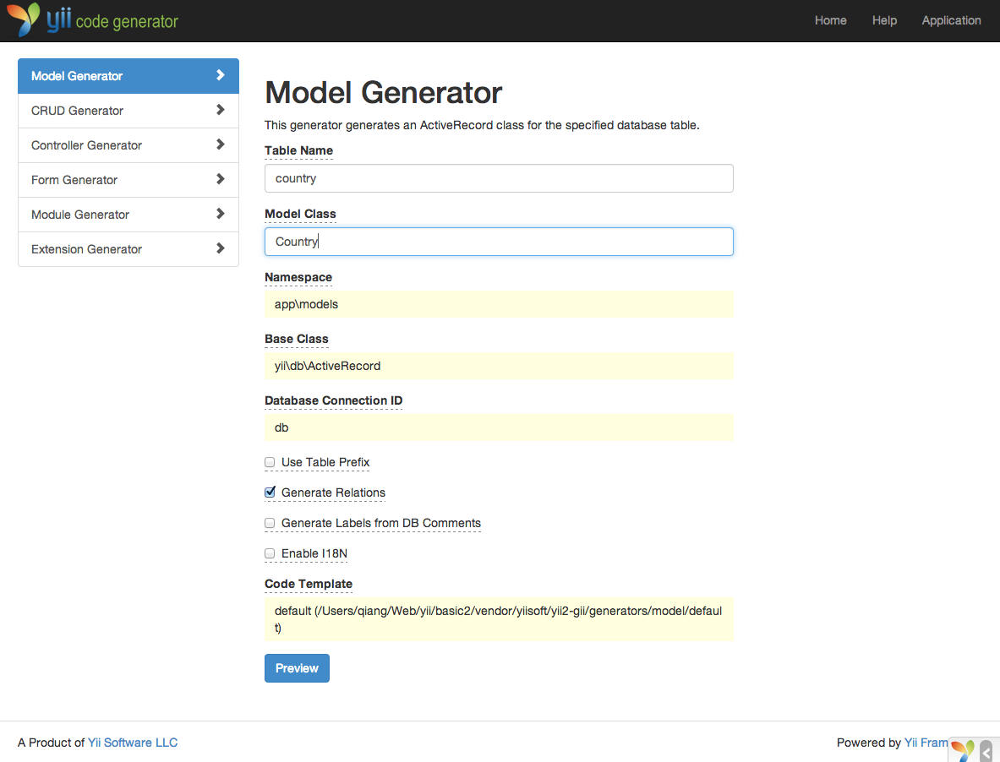
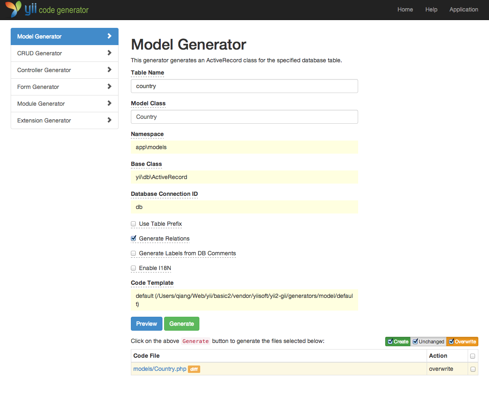

Генерация кода при помощи Gii
========================

В этом разделе, мы опишем как использовать [Gii](tool-gii.md) для автоматической генерации кода
реализующий некоторые общие особенности. Для достижения этой цели, все что вам нужно это просто ввести необходимую информацию в соответствии с инструкциями отображаемыми на веб-страницах Gii.

В этом руководстве, вы узнаете

* Как включить Gii в приложении;
* Как использовать Gii для создания Active Record класса;
* Как использовать Gii для генерироции кода реализующего CRUD для таблицы БД.
* Как настроить код генерируемый Gii.


Запускаем Gii <a name="starting-gii"></a>
------------

[Gii](tool-gii.md) поставляется в Yii как [модуль](structure-modules.md). Вы можете включить Gii
настроив его свойство [[yii\base\Application::modules|modules]] приложения. В частности, вы можете найти следующий код уже приведен в `config/web.php` файле - настройки приложения,

```php
$config = [ ... ];

if (YII_ENV_DEV) {
    $config['bootstrap'][] = 'gii';
    $config['modules']['gii'] = 'yii\gii\Module';
}
```

Приведенная выше конфигурация показывает, что когда в [среде разработки](concept-configurations.md#environment-constants),
приложение должно включать в себя модуль с именем `gii`, который реализует класс [[yii\gii\Module]].

Если вы проверите [входной скрипт](structure-entry-scripts.md) `web/index.php` вашего приложения, вы
найдете следующую строку, которая по сути делает `YII_ENV_DEV`, чтобы быть правдой.

```php
defined('YII_ENV') or define('YII_ENV', 'dev');
```

Благодаря этой строке, ваше приложение находится в режиме разработки, и Gii будет уже включен, в соответствии с описанной выше конфигурации. Теперь вы можете получить доступ к Gii по следующему адресу:

```
http://hostname/index.php?r=gii
```


Генерация класса Active Record <a name="generating-ar"></a>
---------------------------------

Для использования Gii генератора класса Active Record, выберите "Генератор модели" (нажав на ссылку на главной странице Gii). И заполните форму следующим образом:

* Имя таблицы: `country`
* Класс модели : `Country`



Затем нажмите на кнопку "Предварительный просмотр". Вы увидите `models/Country.php` перечислен в результатах файл класса, который будет создан. Вы можете нажать на имя файла класса, для просмотра его содержимого.

При использовании Gii, если вы уже создали такой же файл и хотите перезаписать его, нажмите кнопку `различия` рядом с именем файла, чтобы увидеть различия между генерируемого кода и существующей версии.



Если необхадимо перезаписать существующего файла, установите флажок рядом с "переписать", а затем нажмите кнопку "Создать". При создании нового файла, вы можете просто нажать "Создать".

Далее, вы увидите страницу подтверждения, указывающую что код был успешно создана. Если ваш файл уже существующествует, вы также увидите сообщение о том, что он был переписан с вновь сгенерированным кодом.


Создание CRUD кода <a name="generating-crud"></a>
--------------------

CRUD расшифровывается как Создать, Читать, Обновить, и Удалить, представляющих четыре общие задачи, принятые с данными на большинстве веб-сайтов. Чтобы создать функциональность CRUD используйте Gii, выберите "CRUD Генератор" (нажав на ссылку на главной странице GII). Для «country», например, заполнить полученную форму следующим образом:

* Класс модели : `app\models\Country`
* Класс модели поиска: `app\models\CountrySearch`
* Класс контроллера: `app\controllers\CountryController`


Затем, нажмите на кнопку "Предварительный просмотр". Вы увидите список файлов, которые будут созданы, как показано ниже.

[[ЗДЕСЬ НУЖНА КАРТИНКА]]

Если вы ранее создали `controllers/CountryController.php` и `views/country/index.php` файлы (в разделе базы данных направляющей), установите флажок "переписать", чтобы заменить их. (Предыдущие версии не имеют полной поддержку CRUD.)


Пытается его <a name="trying-it-out"></a>
-------------

Чтобы увидеть как она работает, используйте ваш браузер для доступа к следующему URL:

```
http://hostname/index.php?r=country/index
```

Вы увидите таблицу данных показывающией страны из таблицы базы данных. Вы можете сортировать, или фильтр необходимо ввести условия фильтрации в заголовки столбцов.

Для каждой страны отображающейся в таблице, вы можете просмотреть подробную информацию, обновить ее или удалить.
Вы также можете нажать на кнопку "Создать страну" в верхней части таблицы и будет предоставлена форма для создания новой страны.


Ниже приведен список файлов созданных с помощью Gii, в случае если вы хотите исследовать эту реализацию функций, или их настройки:

* Контроллер: `controllers/CountryController.php`
* Модели: `models/Country.php` and `models/CountrySearch.php`
* Вид: `views/country/*.php`

> Информация: Gii разработан как высоко настраиваемый и расширяемый инструмент генерации кода. Используя его с умом может значительно ускорить скорость разработки приложений. Для более подробной информации, пожалуйста обратитесь к разделу [Gii](tool-gii.md).


Заключение <a name="summary"></a>
-------

В этом разделе, Вы узнали как использовать Gii чтобы генерировать код который реализует полный функциональность CRUD для содержимого которое хранится в таблице базы данных.