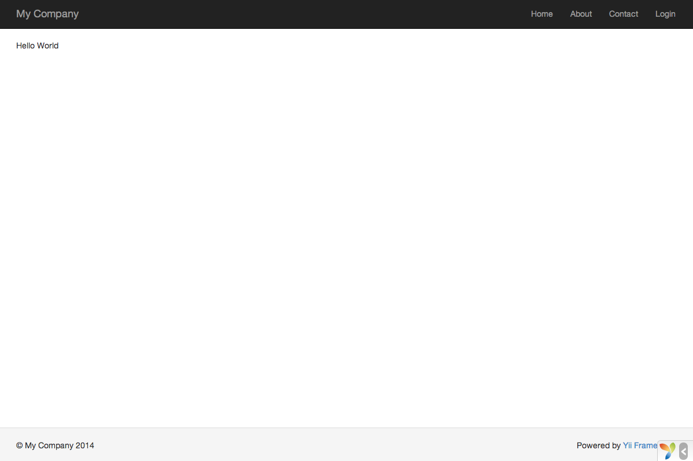

Говоримо «Привіт»
================

В даному розділі розглянемо як створити нову сторінку з надписом «Привіт». В процесі вирішеня задачі ви створите
[подію контролера](structure-controllers.md) і [представлення](structure-views.md):

* Додаток опрацює запит і передасть управління відповідній події;
* Подія, в свою чергу, відобразить представлення з надписом "Привіт" кінцевому користувачу.

З допомогою даного керівництва ви вивчите

* Як створити [подію](structure-controllers.md), яка буде відповідати на запити;
* Як створити [представлення](structure-views.md), щоб формувати зміст відповіді;
* Як додаток відправляє запити до [події](structure-controllers.md).


Створення Події <a name="creating-action"></a>
------------------------------------------------

Для нашої задачі знадобиться [подія](structure-controllers.md) `say`, котра читає параметр `message` із
запиту і відображає його значення користувачу. Якщо в запиті відсутній параметр `message`, то подія буде відображати «Привіт».

> Інформація: [Події](structure-controllers.md) можуть бути запущені безпосередньо користувачем і згруповані в 
  [контролери](structure-controllers.md). Результатом виконання події є відповідь, яку отримує користувач.

Події оголошуються в [контролерах](structure-controllers.md). Для зручності, ви можете оголосити подію
`say` в уже існуючому контролері `SiteController`, який оголошений у файлі класа `controllers/SiteController.php`:

```php
<?php

namespace app\controllers;

use yii\web\Controller;

class SiteController extends Controller
{
    // ...існуючий код...

    public function actionSay($message = 'Привіт')
    {
        return $this->render('say', ['message' => $message]);
    }
}
```

В наведеному коді подія `say` оголошена як метод `actionSay` в класі `SiteController`.
Yii використовує префікс `action` для того, щоб відрізняти методи-події і звичайні методи. Назва післе префікса `action`
вважається ідентифікатором відповідної події.

> Інформація: Ідентифікатори подій задаються в нижньому регістрі. Якщо ідентифікатор складається з декількох слів, вони
  з’єднуються дефісами, тобто `create-comment`. Імена методів подій отримуються шляхом видаленя дефісів з ідентифікатора, перетворення першої літери кожного слова у верхній регістр и добавляня префікса `action`.
  Наприклад, ідентифікатор події `create-comment` відповідає методу `actionCreateComment`.

Метод події приймає параметр `$message`, який за замовчуванням дорівнює `"Привіт"`. Коли додаток отримує запит і оприділяє, що подія `say` відповідає за його опрацювання, параметр наповнюється одноіменним значенням із запиту.

Всередені метода події, для відоюраження [представлення](structure-views.md) з ім’ям `say`, використовується метод
[[yii\web\Controller::render()|render()]]. Для того, щоб вивести повідомлення, у представлення передається параметр `message`.
Результат відображення з допомогою `return` передається додатку, котрий віддає його користувачу.


Створення представлення <a name="creating-view"></a>
---------------------------------------------------

[Представлення](structure-views.md) є скриптами, які використовуються для формування тіла відповіді. Для нашого
додатку ви створите представлення `say`, яке буде виводити параметр `message`, отриманий із метода події:

```php
<?php
use yii\helpers\Html;
?>
<?= Html::encode($message) ?>
```

Представлення `say` мусить бути збережено у файлі `views/site/say.php`. Коли метод [[yii\web\Controller::render()|render()]]
викликається в події, він буде шукати PHP файл з ім’ям виду `views/ControllerID/ActionID/ViewName.php`.

Варто замітити, що в коді вище параметр `message` [[yii\helpers\Html::encode()|екранирується для HTML]] перед відображенням.
Це обов’язково так як параметр приходить від користувача, котрий може спробувати провести
[XSS атаку](http://uk.wikipedia.org/wiki/%D0%9C%D1%96%D0%B6%D1%81%D0%B0%D0%B9%D1%82%D0%BE%D0%B2%D0%B8%D0%B9_%D1%81%D0%BA%D1%80%D0%B8%D0%BF%D1%82%D1%96%D0%BD%D0%B3)
шляхом вставки небезпечного JavaScript кода.

Ви можете доповнити представлення `say` HTML тегами, текстом або кодом PHP. Фактично, представлення `say` є
простим PHP скриптом, який виконується методом [[yii\web\Controller::render()|render()]]. Зміст, який відображається
скриптом представлення, буде передано додатком користувачу.


Спробуєм <a name="trying-it-out"></a>
--------------------------------------

Після створення події і представлення ви можете перейти на нову сторінку по наступному URL:

```
http://hostname/index.php?r=site/say&message=Привіт+світ
```



Буде відображена сторінка з надписом Привіт світ. Вона використовує ту ж шапку і футер, що і решта сторінок додатка.
Якщо ви не вкажете параметр `message`, то побичите на сторінці лише «Привіт». Це відбувається тому, що `message` передається
в метод `actionSay()` і значення за замовчуванням — «Привіт».

> Інформація: Нова сторінка використовує ту ж шапку і футер, що і решта сторінок, тому що метод
  [[yii\web\Controller::render()|render()]] автоматично підставляється в результат представлення `say` в, так називаємий, 
  [макет](structure-views.md) `views/layouts/main.php`.

Параметр `render` потребує додаткових пояснень. Він пов’язаний з [маршрутом (route)](runtime-routing.md), який являє собою унікальний ідентифікатор, який вказує на подію. Його формат `ControllerID/ActionID`. Коли додаток отримує запит, він провіряє параметр `render` і, використовуючи `ControllerID`, визначає який контролер слід використовувати для опрацювання запиту. Потім, контролер використовує частину `ActionID`, щоб визначити яка подія виконує реальну роботу.
В нашому випадку маршрут `site/say` буде відповідати контролеру `SiteController` і його події `say`. 
В результаті, для відпрацювання запиту буде визван метод `SiteController::actionSay()`.

> Інформація: Як і події, контролери також мають ідентифікатори, котрі однозначно визначають їх в додатку.
  Ідентифікатори контролерів використовують ті ж самі правила, що і ідентифікатори подій. Імена класів
  контролерів отримуються шляхом видалення дефісів з ідентифікатора, перетворення першої літери кожного слова у верхній регістр і додавання в кінец `Controller`. Наприклад, ідентифікатор контролера `post-comment` відповідає
  імені класа контролера `PostCommentController`.


Резюме <a name="summary"></a>
-----------------------------

В даному розділі ви затронули тему контролерів и представленнь в паттерні MVC. Ви створили подію як частину контролера,
який опрацьовує запити, і представлення, яке приймає участь у формувані відповіді. В цьому процесі ніяк не була задіяна
модель, так як в ролі даних виступає тільки простий параметр `message`.

Також ви ознайомились із концепцією маршрутизації, котра є сполучною ланкою між запитом користувача і подією контролера.

В наступному розділі ви дізнаєтесь як створювати моделі і добавляти нові сторінки з HTML формами.

