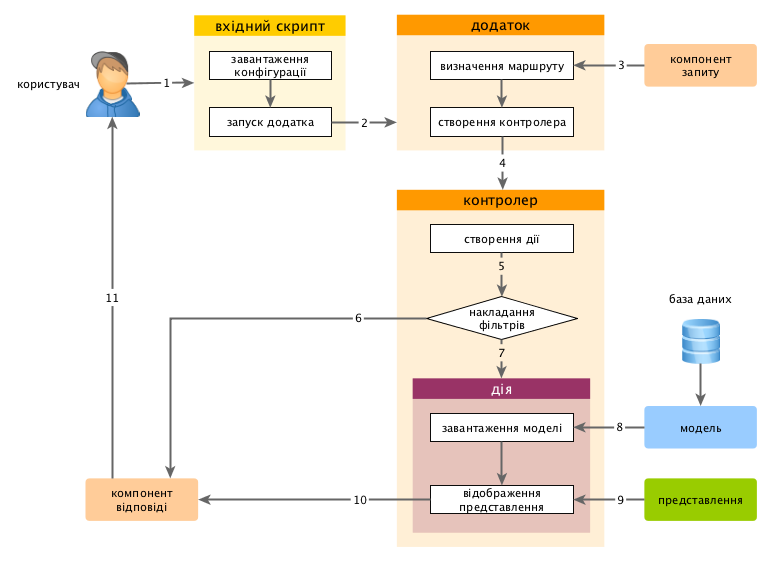

Запуск додатка
==============

<<<<<<< HEAD
Після встановлення Yii, базовий додаток буде доступний або по URL `http://hostname/basic/web/index.php`, 
або по `http://hostname/index.php`, в залежності від налаштування Web сервера. Даний розділ - загальне введення в 
організацію коду, вбудований функціонал і опрацювання запитів додатком Yii.

> Інформація: Для спрощення, далі в даному посібнику передбачається, що Yii встановлений в директорію `basic/web`, 
  яка, в свою чергу, встановлена, як коренева директорія в налаштуваннях Web сервера. В результаті, звернувшись до URL 
=======
Після встановлення Yii, базовий додаток буде доступний або по URL `http://hostname/basic/web/index.php`,
або по `http://hostname/index.php`, в залежності від налаштування Web сервера. Даний розділ - загальне введення в
організацію коду, вбудований функціонал і опрацювання запитів додатком Yii.

> Інформація: Для спрощення, далі в даному посібнику передбачається, що Yii встановлений в директорію `basic/web`,
  яка, в свою чергу, встановлена, як коренева директорія в налаштуваннях Web сервера. В результаті, звернувшись до URL
>>>>>>> yiichina/master
  `http://hostname/index.php` ви отримаєте доступ до додатку. Відрегулюйте URL-адреси для ваших потреб.


Функціонал <span id="functionality"></span>
----------

Вбудований шаблон простого додатку складається з чотирьох сторінок:

* домашня сторінка, відображається при переході по URL `http://hostname/index.php`
* "About" ("Про нас")
* на сторінці "Contact" знаходиться форма зворотнього зв’язку, на якій користувач може звернутися до розробника по e-mail
<<<<<<< HEAD
* на сторінці "Login" відображається форма авторизації. Спробуйте авторизуватись з логіном/паролем "admin/admin". 
  Зверніть увагу на зміну розділу "Login" в головному меню на "Logout".

Ці сторінки використовують спільний хедер (шапка сайта) і футер (підвал). В "шапці" знаходиться головне меню, за 
допомогою якого користувач переміщається по сайту.

У нижній частині вікна ви зможете бачити системні повідомлення Yii - журнал, відлагоджувальну інформацію,
повідомлення про помилки, запити до бази даних і т.п. Відображенням данної інформацію керує 
[вбудований відладчик](tool-debugger.md), він записує і відображає інформацію про хід виконання додатку.

=======
* на сторінці "Login" відображається форма авторизації. Спробуйте авторизуватись з логіном/паролем "admin/admin".
  Зверніть увагу на зміну розділу "Login" в головному меню на "Logout".

Ці сторінки використовують спільний хедер (шапка сайта) і футер (підвал). В "шапці" знаходиться головне меню, за
допомогою якого користувач переміщається по сайту.

У нижній частині вікна ви зможете бачити системні повідомлення Yii - журнал, відлагоджувальну інформацію,
повідомлення про помилки, запити до бази даних і т.п. Відображенням данної інформацію керує
[вбудований відладчик](tool-debugger.md), він записує і відображає інформацію про хід виконання додатку.

Крім веб-додатка, існує консольний скрипт `yii`, що розташований в базовій директорії додатка.
Цей скрипт може бути використаний для виконання фонових завдань або завдань обслуговування додатка.
Все це описано у розділі [Консольні команди](tutorial-console.md).

>>>>>>> yiichina/master

Структура додатка Yii <span id="application-structure"></span>
---------------------

Нижче наведений перелік основних директорій і файлів вашого додатку (вважаємо, що додаток встановлений в директорію `basic`):

```
basic/                  кореневий каталог додатка
    composer.json       використовується Composer'ом, містить опис додатку
    config/             конфігураційні файли
        console.php     конфігурація консольного додатка
        web.php         конфігурація Web додатка
    commands/           містить класи консольних команд
    controllers/        контролери
    models/             моделі
    runtime/            файли, які генерує Yii під час виконання додатку (логи, кеш і т.п.)
    vendor/             містить пакунки Composer'а і, власне, сам фреймворк Yii
    views/              представлення додатку
    web/                коренева директорія Web додатку. Містить файли, доступні через Web
        assets/         скрипти, які використовуються додатком (js, css)
        index.php       місце входження в додаток Yii. З нього розпочинається виконання додатку
    yii                 скрипт виконання консольного додатку Yii
```

<<<<<<< HEAD
В цілому, додаток Yii можна розділити на дві категорії файлів: розміщенні в `basic/web` і розміщенні в інших директоріях. 
=======
В цілому, додаток Yii можна розділити на дві категорії файлів: розміщенні в `basic/web` і розміщенні в інших директоріях.
>>>>>>> yiichina/master
Перша категорія доступна через HTTP (наприклад, браузером), друга недоступна зовні, та і не повинна бути, так як містить службову інформацію.

В Yii реалізована схема проектування [модель-представлення-контролер (MVC)](http://http://uk.wikipedia.org/wiki/Model-View-Controller),
яка відповідає структурі директорій додатка. В директорії `models` знаходяться класи [моделей](structure-models.md),
в `views` розміщені скрипти [представлень](structure-views.md), а в каталозі `controllers` всі класи [контролерів](structure-controllers.md) додатка.

Діаграма нижче демонструє статичну структуру додатка.


<<<<<<< HEAD
В кожному додатку Yii є місце входження в додаток, `web/index.php` - це єдиний PHP-скрипт доступний для виконання через Web. 
Він отримує вхідний запит і створює екземпляр [додатку](structure-applications.md). [Додаток](structure-applications.md) 
опрацьовує вхідні запити з допомогою [компонентів](concept-components.md) і відправляє запит контролеру. 
=======
В кожному додатку Yii є місце входження в додаток, `web/index.php` - це єдиний PHP-скрипт доступний для виконання через Web.
Він отримує вхідний запит і створює екземпляр [додатку](structure-applications.md). [Додаток](structure-applications.md)
опрацьовує вхідні запити з допомогою [компонентів](concept-components.md) і відправляє запит контролеру.
>>>>>>> yiichina/master
[Віджети](structure-widgets.md) використовуються у [представленнях](structure-views.md) для побудови динамічних інтерфейсів сайта.


Життєвий цикл запиту <span id="request-lifecycle"></span>
--------------------

На діаграмі показано, як додаток відпрацьовує запит.



1. Користувач робить запит до [місця входження](structure-entry-scripts.md) `web/index.php`.
<<<<<<< HEAD
2. Скрипт завантажує конфігурацію [configuration](concept-configurations.md) і створює екземпляр 
=======
2. Скрипт завантажує конфігурацію [configuration](concept-configurations.md) і створює екземпляр
>>>>>>> yiichina/master
   [додатку](structure-applications.md) для наступного опрацювання запиту.
3. Додаток визначає [маршрут](runtime-routing.md) запиту за допомогою компонента [запиту](runtime-requests.md) додатка.
4. Додаток створює екземпляр [контролера](structure-controllers.md) для виконання запиту.
5. Контролер, в свою чергу, створює [дію](structure-controllers.md) і накладає на неї фільтри.
6. Якщо хоч один фільтр поверне помилку - виконання додатку зупиняється.
7. Якщо всі фільтри пройдені - додаток виконується.
8. Дія завантажує модель даних. Скоріше за все із бази даних.
9. Дія генерує представлення, відображаючи в ньому дані (в т.ч. і отримані із моделі).
10. Згенерований вид додатку передається як компонент [відповіді](runtime-responses.md).
11. Компонент "відповіді" відправляє готовий результат роботи додатку браузеру користувача.
