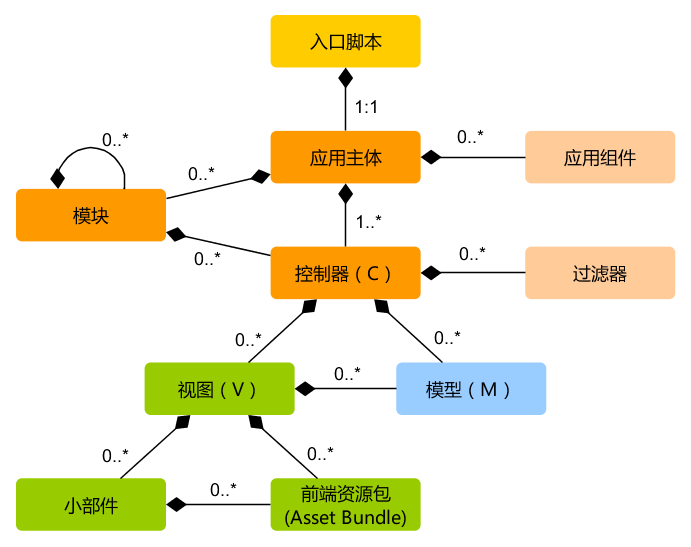

运行应用程序
====================

Yii 安装后，就有了一个可以运行的 Yii 应用程序了，你可以通过 URL `http://hostname/basic/web/index.php` 或
 `http://hostname/index.php` 访问它，具体取决于你的配置。本章将介绍此应用程序的内置功能，代码的组织方式以及总体上程序是
 怎样处理请求的。

> Info: 为简单起见，这个“入门”教程假设你已经将 `basic/web` 设置为了 Web 服务器的文档根目录。访问此程序的是类似
 `http://hostname/index.php` 的 URL 。请根据你的实际情况，在下文描述中作相应调整。


Functionality <a name="functionality"></a>
-------------

The basic application installed contains four pages:

* The homepage, displayed when you access the URL `http://hostname/index.php`,
* the "About" page,
* the "Contact" page, which displays a contact form that allows end users to contact you via email,
* and the "Login" page, which displays a login form that can be used to authenticate end users. Try logging in
  with "admin/admin", and you will find the "Login" main menu item will change to "Logout".

These pages share a common header and footer. The header contains a main menu bar to allow navigation
among different pages.

You should also see a toolbar at the bottom of the browser window.
This is a useful [debugger tool](tool-debugger.md) provided by Yii to record and display a lot of debugging information, such as log messages, response statuses, the database queries run, and so on.


Application Structure <a name="application-structure"></a>
---------------------

The most important directories and files in your application are (assuming the application's root directory is `basic`):

```
basic/                  application base path
    composer.json       used by Composer, describes package information
    config/             contains application and other configurations
        console.php     the console application configuration
        web.php         the Web application configuration
    commands/           contains console command classes
    controllers/        contains controller classes
    models/             contains model classes
    runtime/            contains files generated by Yii during runtime, such as logs and cache files
    vendor/             contains the installed Composer packages, including the Yii framework itself
    views/              contains view files
    web/                application Web root, contains Web accessible files
        assets/         contains published asset files (javascript and css) by Yii
        index.php       the entry (or bootstrap) script for the application
    yii                 the Yii console command execution script
```

In general, the files in the application can be divided into two types: those under `basic/web` and those
under other directories. The former can be directly accessed via HTTP (i.e., in a browser), while the latter can not and should not be.

Yii implements the [model-view-controller (MVC)](http://wikipedia.org/wiki/Model-view-controller) design pattern,
which is reflected in the above directory organization. The `models` directory contains all [model classes](structure-models.md),
the `views` directory contains all [view scripts](structure-views.md), and the `controllers` directory contains
all [controller classes](structure-controllers.md).

The following diagram shows the static structure of an application.



Each application has an entry script `web/index.php` which is the only Web accessible PHP script in the application.
The entry script takes an incoming request and creates an [application](structure-applications.md) instance to handle it.
The [application](structure-applications.md) resolves the request with the help of its [components](concept-components.md),
and dispatches the request to the MVC elements. [Widgets](structure-widgets.md) are used in the [views](structure-views.md)
to help build complex and dynamic user interface elements.


Request Lifecycle <a name="request-lifecycle"></a>
-----------------

The following diagram shows how an application handles a request.


1. A user makes a request to the [entry script](structure-entry-scripts.md) `web/index.php`.
2. The entry script loads the application [configuration](concept-configurations.md) and creates
   an [application](structure-applications.md) instance to handle the request.
3. The application resolves the requested [route](runtime-routing.md) with the help of
   the [request](runtime-requests.md) application component.
4. The application creates a [controller](structure-controllers.md) instance to handle the request.
5. The controller creates an [action](structure-controllers.md) instance and performs the filters for the action.
6. If any filter fails, the action is cancelled.
7. If all filters pass, the action is executed.
8. The action loads a data model, possibly from a database.
9. The action renders a view, providing it with the data model.
10. The rendered result is returned to the [response](runtime-responses.md) application component.
11. The response component sends the rendered result to the user's browser.

